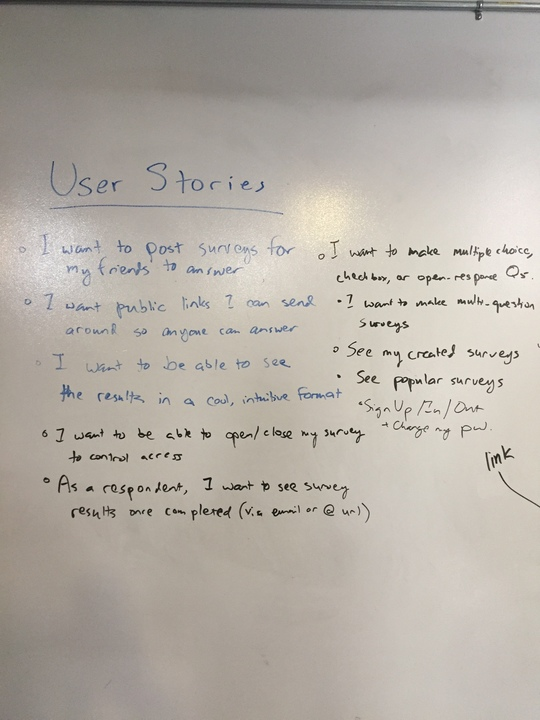
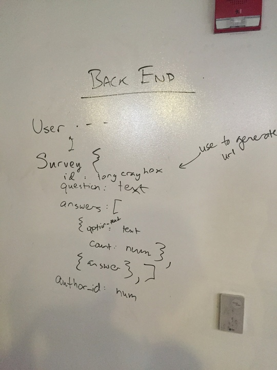

# SoftSurv
[SoftSurv](https://github.com/Schoof-There-It-Is/SoftSurv)

**SoftSurv** is a light-weight survey app dsigned to send single-question, multiple-choice surveys to your friends and coworkers.


## Technologies

We made **SoftSurv** using:

-   HTML/CSS
-   JavaScript
-   jQuery
-   Handlebars
-   Bootstrap
-   Express
-   Mongoose
-   Node.js
-   MongoDB


## Approach

Our general approach was to cleary define a goal or benchmark and develop a series of steps necessary to complete it. Some of those steps required all three of us to commisserate and brainstorm to reach a solution, but we would often divide the list of steps so we could complete tasks individually or through pair progrmaming. Once a benchmark was met, a significant feature was developed, or a significant decision needed to be made, we would reconvene to adjust our individual goals and benchmarks.


## The Hurdles

We had a difficult time navigating the survey schema in order to increment each survey's answer as the user submitted it. To achieve this, we created a custom route and controller action that would find the survey by ID, and increment the vote count by one before constructing a new question object, which was passed to the survey's *update* method. The questions were also sorted by number of votes, so the winner would be displayed first.

Survey Schema:

```js
const optionSchema = new mongoose.Schema({
  text: String,
  votes: Number
});

const surveySchema = new mongoose.Schema({

  question: {
    type: String,
    required: true,
  },
  options: {
    required:true,
    type: [optionSchema],
  },

  _author: {
    type: mongoose.Schema.Types.ObjectId,
    ref: 'User',
    required: true,
  },
}, {
  timestamps: true,
  toJSON: { virtuals: true },
});
```

Controller action to increment and sort questions:
```js
const respond = (req, res, next) => {
  let search = { _id: req.params.id };
  Survey.findOne(search)
    .then(survey => {
      if (!survey) {
        return next();
      }
      let responseOptions = survey.options;
      responseOptions[req.body.index].votes += 1;
      //sorts responseOptions by votes
      responseOptions.sort(function(a, b) {
        if(a.votes < b.votes){
          return 1;
        } else if (a.votes > b.votes){
          return -1;
        }else {
          return 0;
        }
      });
      let updatedSurvey = { "survey": {} };
      updatedSurvey.options = responseOptions;
      return survey.update(updatedSurvey)
        .then(() => res.sendStatus(200));
    })
    .catch(err => next(err));
};
```

We also wanted to be able to add the option to add more questions per survey, and more varieties of answers, such as text, 1-10, etc., but we decided not to pursue those options and focus on the user experience.


## User Stories

- I want to post surveys for my friends to answer
- I want links I can send around so that anyone can answer
- I want to see the results in an intuitive format
- I want to be able to see and delete the surveys I've created




## ERD



## Wireframes


## [Backend Repo](https://github.com/Schoof-There-It-Is/softsurv-server)


## [License](LICENSE)

Source code distributed under the MIT license. Text and other assets copyright
General Assembly, Inc., all rights reserved.
# softsurv-client
